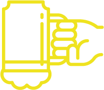

  

### Bottoms Up

Bottoms Up is a simple yet powerful application designed to help you discover a wide variety of cocktails based on the ingredients you have on hand. Whether you're hosting a party, experimenting with mixology, or simply craving a refreshing beverage, Bottoms Up has you covered!

---

#### Features

- **Ingredient-Based Search:** Input the ingredients you have available, and Bottoms Up will generate a list of cocktails you can make with those ingredients.
- **Extensive Cocktail Database:** Access a comprehensive database of cocktail recipes, ranging from classic favorites to innovative creations.
- **Detailed Recipes:** Each cocktail comes with a detailed recipe, including ingredients, measurements, and preparation instructions.
- **Random Recipes:** Too many choices? Don't worry, our random option will select for you a unique drink.

#### How to Use

1. **Enter Your Ingredients:** Input the ingredients you have available choosing from our list to find a recipe you could make.
2. **Explore Recipes:** Browse through the list of cocktails and click on any cocktail to view its recipe.
3. **Non-alcoholic Options:** Select 'Non-alcoholic Mode' to get alcohol free recipes.
4. **Enter the name:** Already have something on mind? Input the name to get the recipe!

---

### Technologies Used

- React
- JavaScript
- CSS

### Credits

Bottoms Up utilizes the [TheCocktailDB API](https://www.thecocktaildb.com/api.php) to access its extensive collection of cocktail recipes.

### Contribute

Found a bug or have a suggestion for improvement? We welcome contributions from the community! Feel free to submit a pull request or open an issue on GitHub.

### License

This project is licensed under the GNU GENERAL PUBLIC LICENSE Version 3 - see the LICENSE file for details.

---

Enjoy exploring and experimenting with Bottoms Up! Cheers! 🍹🎉
